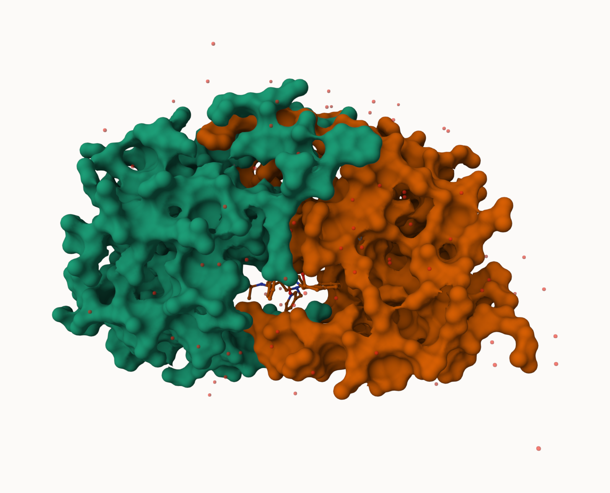

# Class 10
Yanlin

Q1: What percentage of structures in the PDB are solved by X-Ray and
Electron Microscopy. –83.255 and 10.234 respectively.

Q2: What proportion of structures in the PDB are protein? –protein only
is 86.4%

Q3: Type HIV in the PDB website search box on the home page and
determine how many HIV-1 protease structures are in the current PDB?
–4,563

``` r
pdbsum <- read.csv("Data Export Summary.csv", row.names = 1)
pdbsum
```

                              X.ray     EM    NMR Multiple.methods Neutron Other
    Protein (only)          167,317 15,698 12,534              208      77    32
    Protein/Oligosaccharide   9,645  2,639     34                8       2     0
    Protein/NA                8,735  4,718    286                7       0     0
    Nucleic acid (only)       2,869    138  1,507               14       3     1
    Other                       170     10     33                0       0     0
    Oligosaccharide (only)       11      0      6                1       0     4
                              Total
    Protein (only)          195,866
    Protein/Oligosaccharide  12,328
    Protein/NA               13,746
    Nucleic acid (only)       4,532
    Other                       213
    Oligosaccharide (only)       22

``` r
x <- pdbsum$Total
x
```

    [1] "195,866" "12,328"  "13,746"  "4,532"   "213"     "22"     

``` r
convert_comma_number <- function(x) {
  x <- gsub(',','', x)
  x <- as.numeric(x)
  return(x)
}

n.tot <- sum(convert_comma_number(x))
```

The `apply()` function takes any function and “apply” it over either the
ROWs or COLs of a data.frame

``` r
n.pdbsum <- apply(pdbsum, 2, convert_comma_number)
colSums(apply(pdbsum, 2, convert_comma_number)) / n.tot
```

               X.ray               EM              NMR Multiple.methods 
        0.8325592064     0.1023479646     0.0635181093     0.0010498132 
             Neutron            Other            Total 
        0.0003617003     0.0001632063     1.0000000000 

``` r
n.pdbsum[1, "Total"]/n.tot
```

       Total 
    0.863961 

`read_csv()` from library `readr` can remove `,` in the numeric data
automatically

## Using Mol\*

 Q4: Water molecules normally
have 3 atoms. Why do we see just one atom per water molecule in this
structure? – H is too small

Q5: There is a critical “conserved” water molecule in the binding site.
Can you identify this water molecule? What residue number does this
water molecule have –308

Q6: Generate and save a figure clearly showing the two distinct chains
of HIV-protease along with the ligand. You might also consider showing
the catalytic residues ASP 25 in each chain and the critical water (we
recommend “Ball & Stick” for these side-chains)




Q7: How many amino acid residues are there in this pdb object? –198

Q8: Name one of the two non-protein residues? –HOH (127), MK1 (1)

Q9: How many protein chains are in this structure? –2

``` r
library(bio3d)
library(shiny)
library(r3dmol)
```

``` r
pdb <- read.pdb("1hsg.pdb")
pdb
```


     Call:  read.pdb(file = "1hsg.pdb")

       Total Models#: 1
         Total Atoms#: 1686,  XYZs#: 5058  Chains#: 2  (values: A B)

         Protein Atoms#: 1514  (residues/Calpha atoms#: 198)
         Nucleic acid Atoms#: 0  (residues/phosphate atoms#: 0)

         Non-protein/nucleic Atoms#: 172  (residues: 128)
         Non-protein/nucleic resid values: [ HOH (127), MK1 (1) ]

       Protein sequence:
          PQITLWQRPLVTIKIGGQLKEALLDTGADDTVLEEMSLPGRWKPKMIGGIGGFIKVRQYD
          QILIEICGHKAIGTVLVGPTPVNIIGRNLLTQIGCTLNFPQITLWQRPLVTIKIGGQLKE
          ALLDTGADDTVLEEMSLPGRWKPKMIGGIGGFIKVRQYDQILIEICGHKAIGTVLVGPTP
          VNIIGRNLLTQIGCTLNF

    + attr: atom, xyz, seqres, helix, sheet,
            calpha, remark, call

``` r
attributes(pdb)
```

    $names
    [1] "atom"   "xyz"    "seqres" "helix"  "sheet"  "calpha" "remark" "call"  

    $class
    [1] "pdb" "sse"

``` r
adk <- read.pdb("6s36")
```

      Note: Accessing on-line PDB file
       PDB has ALT records, taking A only, rm.alt=TRUE

``` r
adk
```


     Call:  read.pdb(file = "6s36")

       Total Models#: 1
         Total Atoms#: 1898,  XYZs#: 5694  Chains#: 1  (values: A)

         Protein Atoms#: 1654  (residues/Calpha atoms#: 214)
         Nucleic acid Atoms#: 0  (residues/phosphate atoms#: 0)

         Non-protein/nucleic Atoms#: 244  (residues: 244)
         Non-protein/nucleic resid values: [ CL (3), HOH (238), MG (2), NA (1) ]

       Protein sequence:
          MRIILLGAPGAGKGTQAQFIMEKYGIPQISTGDMLRAAVKSGSELGKQAKDIMDAGKLVT
          DELVIALVKERIAQEDCRNGFLLDGFPRTIPQADAMKEAGINVDYVLEFDVPDELIVDKI
          VGRRVHAPSGRVYHVKFNPPKVEGKDDVTGEELTTRKDDQEETVRKRLVEYHQMTAPLIG
          YYSKEAEAGNTKYAKVDGTKPVAEVRADLEKILG

    + attr: atom, xyz, seqres, helix, sheet,
            calpha, remark, call

``` r
m <- nma(adk)
```

     Building Hessian...        Done in 0.034 seconds.
     Diagonalizing Hessian...   Done in 0.603 seconds.

``` r
plot(m)
```


``` r
mktrj(m, file="adk_m7.pdb")
```
