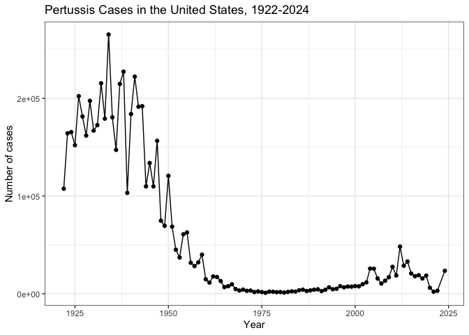
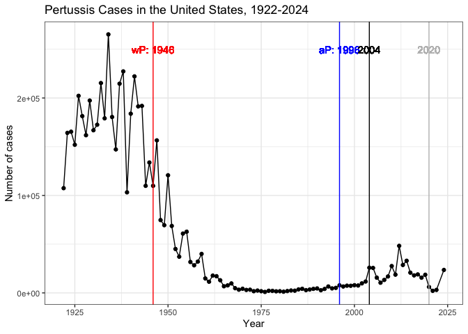
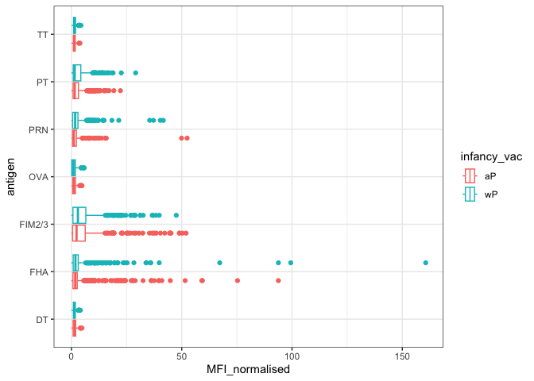
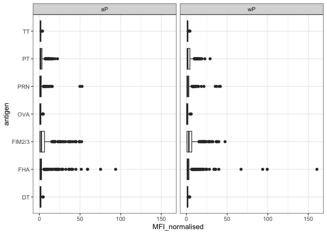
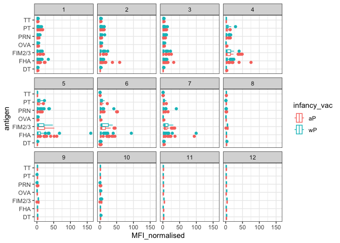
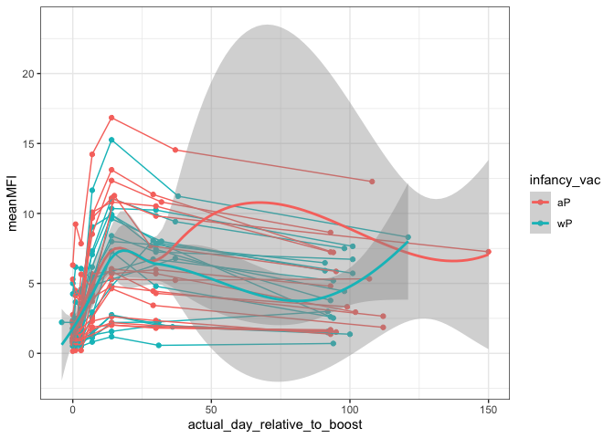

# Class 15: Pertussis Resurgence
Yanlin

Q1. With the help of the R “addin” package datapasta assign the CDC
pertussis case number data to a data frame called `cdc` and use ggplot
to make a plot of cases numbers over time.

``` r
library(datapasta)
#Paste as data.frame
cdc <- data.frame(
                  year = c(1922L,1923L,
                                                       1924L,1925L,1926L,1927L,
                                                       1928L,1929L,1930L,
                                                       1931L,1932L,1933L,1934L,
                                                       1935L,1936L,1937L,1938L,
                                                       1939L,1940L,1941L,
                                                       1942L,1943L,1944L,1945L,
                                                       1946L,1947L,1948L,
                                                       1949L,1950L,1951L,1952L,
                                                       1953L,1954L,1955L,
                                                       1956L,1957L,1958L,1959L,
                                                       1960L,1961L,1962L,1963L,
                                                       1964L,1965L,1966L,
                                                       1967L,1968L,1969L,1970L,
                                                       1971L,1972L,1973L,
                                                       1974L,1975L,1976L,1977L,
                                                       1978L,1979L,1980L,
                                                       1981L,1982L,1983L,1984L,
                                                       1985L,1986L,1987L,1988L,
                                                       1989L,1990L,1991L,
                                                       1992L,1993L,1994L,1995L,
                                                       1996L,1997L,1998L,
                                                       1999L,2000L,2001L,2002L,
                                                       2003L,2004L,2005L,
                                                       2006L,2007L,2008L,2009L,
                                                       2010L,2011L,2012L,2013L,
                                                       2014L,2015L,2016L,
                                                       2017L,2018L,2019L,2020L,
                                                       2021L,2022L, 2024L),
                      cases = c(107473,164191,
                                                       165418,152003,202210,
                                                       181411,161799,197371,
                                                       166914,172559,215343,
                                                       179135,265269,180518,
                                                       147237,214652,227319,103188,
                                                       183866,222202,191383,
                                                       191890,109873,133792,
                                                       109860,156517,74715,
                                                       69479,120718,68687,45030,
                                                       37129,60886,62786,
                                                       31732,28295,32148,40005,
                                                       14809,11468,17749,
                                                       17135,13005,6799,7717,
                                                       9718,4810,3285,4249,
                                                       3036,3287,1759,2402,1738,
                                                       1010,2177,2063,1623,
                                                       1730,1248,1895,2463,
                                                       2276,3589,4195,2823,
                                                       3450,4157,4570,2719,
                                                       4083,6586,4617,5137,
                                                       7796,6564,7405,7298,7867,
                                                       7580,9771,11647,
                                                       25827,25616,15632,10454,
                                                       13278,16858,27550,18719,
                                                       48277,28639,32971,
                                                       20762,17972,18975,15609,
                                                       18617,6124,2116,3044, 23544)
                    )
```

Q2. Using the ggplot geom_vline() function add lines to your previous
plot for the 1946 introduction of the wP vaccine and the 1996 switch to
aP vaccine. What do you notice?

``` r
library(ggplot2)
baseplot <- ggplot(cdc) +
              aes(year, cases) +
              geom_point() +
              geom_line() +
              labs(x = "Year", y = "Number of cases", title = "Pertussis Cases in the United States, 1922-2024")
baseplot + theme_bw()
```



``` r
baseplot + geom_vline(xintercept = 1946, color = "red") + 
  geom_text(aes(x = 1946, y = 250000, label = "wP: 1946"), color = "red") +
  geom_vline(xintercept = 1996, color = "blue") + 
  geom_text(aes(x = 1996, y = 250000, label = "aP: 1996"), color = "blue") + 
  geom_vline(xintercept = 2020, color = "grey") + 
  geom_text(aes(x = 2020, y = 250000, label = "2020"), color = "grey") +
  geom_vline(xintercept = 2004) + geom_text(aes(x = 2004, y = 250000, label = "2004")) +
  theme_bw()
```

    Warning in geom_text(aes(x = 1946, y = 250000, label = "wP: 1946"), color = "red"): All aesthetics have length 1, but the data has 102 rows.
    ℹ Please consider using `annotate()` or provide this layer with data containing
      a single row.

    Warning in geom_text(aes(x = 1996, y = 250000, label = "aP: 1996"), color = "blue"): All aesthetics have length 1, but the data has 102 rows.
    ℹ Please consider using `annotate()` or provide this layer with data containing
      a single row.

    Warning in geom_text(aes(x = 2020, y = 250000, label = "2020"), color = "grey"): All aesthetics have length 1, but the data has 102 rows.
    ℹ Please consider using `annotate()` or provide this layer with data containing
      a single row.

    Warning in geom_text(aes(x = 2004, y = 250000, label = "2004")): All aesthetics have length 1, but the data has 102 rows.
    ℹ Please consider using `annotate()` or provide this layer with data containing
      a single row.



Q3. Describe what happened after the introduction of the aP vaccine? Do
you have a possible explanation for the observed trend? - Vaccines cant
last for decades, so the immunity of the population decreases over time,
and the number of cases increases.

## CMI-PB (Computational Models of Immunity - Pertussis Boost)

This project collects and makes freely available data about the immune
response to pertussis vaccination.

We can access the data cia an API which returns JSON format We can use
the **jsonlite** package and its `read_json()` to convert the JSON data
to an R data frame.

``` r
library(jsonlite)
subject <- read_json("https://www.cmi-pb.org/api/v5/subject", simplifyVector = TRUE)
```

Let’s have wee peak and explore this

``` r
head(subject)
```

      subject_id infancy_vac biological_sex              ethnicity  race
    1          1          wP         Female Not Hispanic or Latino White
    2          2          wP         Female Not Hispanic or Latino White
    3          3          wP         Female                Unknown White
    4          4          wP           Male Not Hispanic or Latino Asian
    5          5          wP           Male Not Hispanic or Latino Asian
    6          6          wP         Female Not Hispanic or Latino White
      year_of_birth date_of_boost      dataset
    1    1986-01-01    2016-09-12 2020_dataset
    2    1968-01-01    2019-01-28 2020_dataset
    3    1983-01-01    2016-10-10 2020_dataset
    4    1988-01-01    2016-08-29 2020_dataset
    5    1991-01-01    2016-08-29 2020_dataset
    6    1988-01-01    2016-10-10 2020_dataset

``` r
#Q. How many subjects do we have?
nrow(subject)
```

    [1] 172

``` r
#Q4. How many aP and wP infancy vaccinated subjects are in the dataset?
table(subject$infancy_vac)
```


    aP wP 
    87 85 

``` r
#Q5. How many males and females?
table(subject$biological_sex)
```


    Female   Male 
       112     60 

``` r
#Q6. What is the breakdown of race and biological sex (e.g. number of Asian females, White males etc…)?
table(subject$race, subject$biological_sex)
```

                                               
                                                Female Male
      American Indian/Alaska Native                  0    1
      Asian                                         32   12
      Black or African American                      2    3
      More Than One Race                            15    4
      Native Hawaiian or Other Pacific Islander      1    1
      Unknown or Not Reported                       14    7
      White                                         48   32

``` r
table(subject$dataset)
```


    2020_dataset 2021_dataset 2022_dataset 2023_dataset 
              60           36           22           54 

``` r
specimen <- read_json("https://www.cmi-pb.org/api/v5/specimen", simplifyVector = TRUE)
ab_titer <- read_json("https://www.cmi-pb.org/api/v5/plasma_ab_titer", simplifyVector = TRUE)
```

``` r
head(specimen)
```

      specimen_id subject_id actual_day_relative_to_boost
    1           1          1                           -3
    2           2          1                            1
    3           3          1                            3
    4           4          1                            7
    5           5          1                           11
    6           6          1                           32
      planned_day_relative_to_boost specimen_type visit
    1                             0         Blood     1
    2                             1         Blood     2
    3                             3         Blood     3
    4                             7         Blood     4
    5                            14         Blood     5
    6                            30         Blood     6

``` r
head(ab_titer)
```

      specimen_id isotype is_antigen_specific antigen        MFI MFI_normalised
    1           1     IgE               FALSE   Total 1110.21154       2.493425
    2           1     IgE               FALSE   Total 2708.91616       2.493425
    3           1     IgG                TRUE      PT   68.56614       3.736992
    4           1     IgG                TRUE     PRN  332.12718       2.602350
    5           1     IgG                TRUE     FHA 1887.12263      34.050956
    6           1     IgE                TRUE     ACT    0.10000       1.000000
       unit lower_limit_of_detection
    1 UG/ML                 2.096133
    2 IU/ML                29.170000
    3 IU/ML                 0.530000
    4 IU/ML                 6.205949
    5 IU/ML                 4.679535
    6 IU/ML                 2.816431

### Merge datasets together

`inner_join()` takes the common columns between two data frames and
joins them together; `full_join()` takes all columns from both data
frames and joins them together.

``` r
library(dplyr)
```


    Attaching package: 'dplyr'

    The following objects are masked from 'package:stats':

        filter, lag

    The following objects are masked from 'package:base':

        intersect, setdiff, setequal, union

``` r
#join subject and specimen together
meta <- inner_join(subject, specimen, by = "subject_id")
#join meta and ab_titer together
abdata <- inner_join(meta, ab_titer, by = "specimen_id")
```

``` r
head(abdata)
```

      subject_id infancy_vac biological_sex              ethnicity  race
    1          1          wP         Female Not Hispanic or Latino White
    2          1          wP         Female Not Hispanic or Latino White
    3          1          wP         Female Not Hispanic or Latino White
    4          1          wP         Female Not Hispanic or Latino White
    5          1          wP         Female Not Hispanic or Latino White
    6          1          wP         Female Not Hispanic or Latino White
      year_of_birth date_of_boost      dataset specimen_id
    1    1986-01-01    2016-09-12 2020_dataset           1
    2    1986-01-01    2016-09-12 2020_dataset           1
    3    1986-01-01    2016-09-12 2020_dataset           1
    4    1986-01-01    2016-09-12 2020_dataset           1
    5    1986-01-01    2016-09-12 2020_dataset           1
    6    1986-01-01    2016-09-12 2020_dataset           1
      actual_day_relative_to_boost planned_day_relative_to_boost specimen_type
    1                           -3                             0         Blood
    2                           -3                             0         Blood
    3                           -3                             0         Blood
    4                           -3                             0         Blood
    5                           -3                             0         Blood
    6                           -3                             0         Blood
      visit isotype is_antigen_specific antigen        MFI MFI_normalised  unit
    1     1     IgE               FALSE   Total 1110.21154       2.493425 UG/ML
    2     1     IgE               FALSE   Total 2708.91616       2.493425 IU/ML
    3     1     IgG                TRUE      PT   68.56614       3.736992 IU/ML
    4     1     IgG                TRUE     PRN  332.12718       2.602350 IU/ML
    5     1     IgG                TRUE     FHA 1887.12263      34.050956 IU/ML
    6     1     IgE                TRUE     ACT    0.10000       1.000000 IU/ML
      lower_limit_of_detection
    1                 2.096133
    2                29.170000
    3                 0.530000
    4                 6.205949
    5                 4.679535
    6                 2.816431

``` r
table(abdata$isotype)
```


      IgE   IgG  IgG1  IgG2  IgG3  IgG4 
     6698  5389 10117 10124 10124 10124 

``` r
table(abdata$antigen)
```


        ACT   BETV1      DT   FELD1     FHA  FIM2/3   LOLP1     LOS Measles     OVA 
       1970    1970    4978    1970    5372    4978    1970    1970    1970    4978 
        PD1     PRN      PT     PTM   Total      TT 
       1970    5372    5372    1970     788    4978 

Make a boxplot with IgG - this will be a plot of MFI vs. antigen

``` r
igg <- filter(abdata, isotype == "IgG")
ggplot(igg) +
  aes(MFI_normalised, antigen, col = infancy_vac) +
  geom_boxplot() +
  theme_bw()
```



``` r
ggplot(igg) +
  aes(MFI_normalised, antigen) +
  geom_boxplot() +
  facet_wrap(~infancy_vac) +
  theme_bw()
```



Group the plot by before the booster and after the booster

``` r
ggplot(igg) +
  aes(MFI_normalised, antigen, col=infancy_vac) +
  geom_boxplot() +
  facet_wrap(~visit) +
  theme_bw()
```



``` r
#filter igg for year 2021, group by antigen, and add mean of MFI_normalized by antigen to the dataset
igg2021 <- filter(igg, dataset == "2021_dataset") %>% group_by(subject_id, actual_day_relative_to_boost, infancy_vac) %>% summarise(meanMFI = mean(MFI_normalised))
```

    `summarise()` has grouped output by 'subject_id',
    'actual_day_relative_to_boost'. You can override using the `.groups` argument.

``` r
#Make line graph of MFI vs. day relative to boost by subject_id
igg2021$subject_id <- as.factor(igg2021$subject_id)
ggplot(igg2021) +
  aes(actual_day_relative_to_boost, meanMFI, group = subject_id, col = infancy_vac) +
  geom_point() + 
  geom_line() + 
  geom_smooth(aes(group = NULL)) +
  theme_bw()
```

    `geom_smooth()` using method = 'loess' and formula = 'y ~ x'


