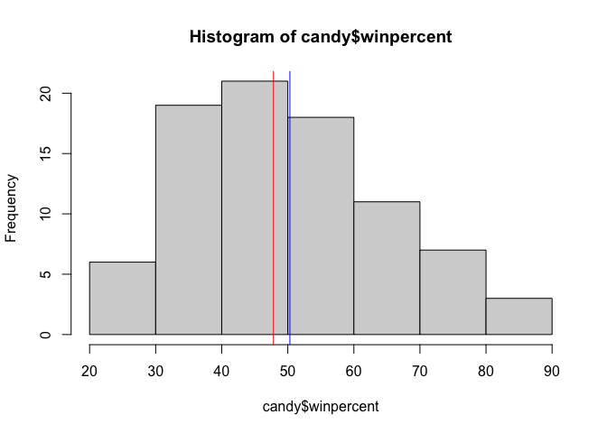
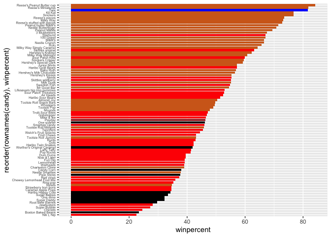
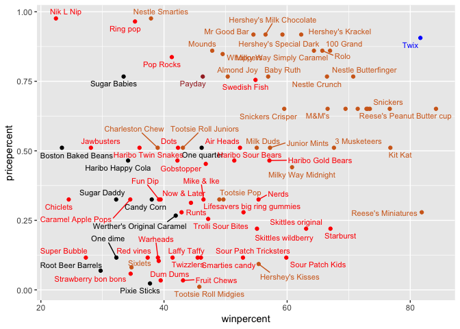
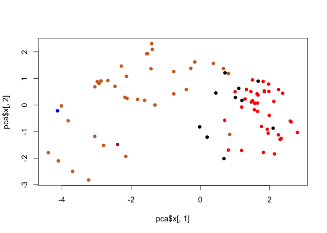
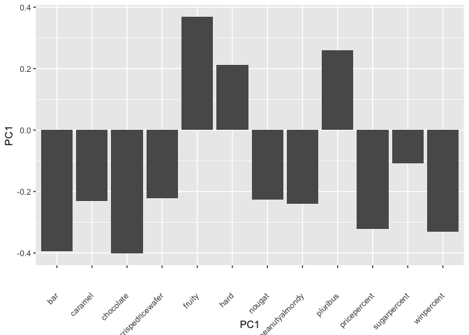

# Class 9


Q1. How many different candy types are in this dataset? –9 Q2. How many
fruity candy types are in the dataset? –38

``` r
url <- "https://raw.githubusercontent.com/fivethirtyeight/data/master/candy-power-ranking/candy-data.csv"

candy = read.csv(url, row.names=1)
head(candy)
```

                 chocolate fruity caramel peanutyalmondy nougat crispedricewafer
    100 Grand            1      0       1              0      0                1
    3 Musketeers         1      0       0              0      1                0
    One dime             0      0       0              0      0                0
    One quarter          0      0       0              0      0                0
    Air Heads            0      1       0              0      0                0
    Almond Joy           1      0       0              1      0                0
                 hard bar pluribus sugarpercent pricepercent winpercent
    100 Grand       0   1        0        0.732        0.860   66.97173
    3 Musketeers    0   1        0        0.604        0.511   67.60294
    One dime        0   0        0        0.011        0.116   32.26109
    One quarter     0   0        0        0.011        0.511   46.11650
    Air Heads       0   0        0        0.906        0.511   52.34146
    Almond Joy      0   1        0        0.465        0.767   50.34755

``` r
sum(candy$fruity==1)
```

    [1] 38

Q3. What is your favorite candy in the dataset and what is it’s
winpercent value? –Twix, 81.64291 Q4. What is the winpercent value for
“Kit Kat”? –76.7686 Q5. What is the winpercent value for “Tootsie Roll
Snack Bars”? –49.6535

``` r
candy["Kit Kat",]$winpercent
```

    [1] 76.7686

``` r
library(dplyr)
```


    Attaching package: 'dplyr'

    The following objects are masked from 'package:stats':

        filter, lag

    The following objects are masked from 'package:base':

        intersect, setdiff, setequal, union

``` r
candy |> 
  filter(rownames(candy)=="Tootsie Roll Snack Bars") |> 
  select(winpercent)
```

                            winpercent
    Tootsie Roll Snack Bars    49.6535

The `%in%` is useful for checking the intersection of two vectors

``` r
#do elements in c1 exist in c2
c("barry", "liz", "chandra") %in% c("paul", "alice", "liz")
```

    [1] FALSE  TRUE FALSE

``` r
#select based on multiple conditions
candy |>
  filter(winpercent > 75)|>
  filter(pricepercent < 0.5)
```

                       chocolate fruity caramel peanutyalmondy nougat
    Reese's Miniatures         1      0       0              1      0
                       crispedricewafer hard bar pluribus sugarpercent pricepercent
    Reese's Miniatures                0    0   0        0        0.034        0.279
                       winpercent
    Reese's Miniatures   81.86626

Q6. Is there any variable/column that looks to be on a different scale
to the majority of the other columns in the dataset? –winpercent Q7.
What do you think a zero and one represent for the candy\$chocolate
column? –“0” means non-chocolate, “1” means containing chocolate

``` r
library(skimr)
skim(candy)
```

|                                                  |       |
|:-------------------------------------------------|:------|
| Name                                             | candy |
| Number of rows                                   | 85    |
| Number of columns                                | 12    |
| \_\_\_\_\_\_\_\_\_\_\_\_\_\_\_\_\_\_\_\_\_\_\_   |       |
| Column type frequency:                           |       |
| numeric                                          | 12    |
| \_\_\_\_\_\_\_\_\_\_\_\_\_\_\_\_\_\_\_\_\_\_\_\_ |       |
| Group variables                                  | None  |

Data summary

**Variable type: numeric**

| skim_variable | n_missing | complete_rate | mean | sd | p0 | p25 | p50 | p75 | p100 | hist |
|:---|---:|---:|---:|---:|---:|---:|---:|---:|---:|:---|
| chocolate | 0 | 1 | 0.44 | 0.50 | 0.00 | 0.00 | 0.00 | 1.00 | 1.00 | ▇▁▁▁▆ |
| fruity | 0 | 1 | 0.45 | 0.50 | 0.00 | 0.00 | 0.00 | 1.00 | 1.00 | ▇▁▁▁▆ |
| caramel | 0 | 1 | 0.16 | 0.37 | 0.00 | 0.00 | 0.00 | 0.00 | 1.00 | ▇▁▁▁▂ |
| peanutyalmondy | 0 | 1 | 0.16 | 0.37 | 0.00 | 0.00 | 0.00 | 0.00 | 1.00 | ▇▁▁▁▂ |
| nougat | 0 | 1 | 0.08 | 0.28 | 0.00 | 0.00 | 0.00 | 0.00 | 1.00 | ▇▁▁▁▁ |
| crispedricewafer | 0 | 1 | 0.08 | 0.28 | 0.00 | 0.00 | 0.00 | 0.00 | 1.00 | ▇▁▁▁▁ |
| hard | 0 | 1 | 0.18 | 0.38 | 0.00 | 0.00 | 0.00 | 0.00 | 1.00 | ▇▁▁▁▂ |
| bar | 0 | 1 | 0.25 | 0.43 | 0.00 | 0.00 | 0.00 | 0.00 | 1.00 | ▇▁▁▁▂ |
| pluribus | 0 | 1 | 0.52 | 0.50 | 0.00 | 0.00 | 1.00 | 1.00 | 1.00 | ▇▁▁▁▇ |
| sugarpercent | 0 | 1 | 0.48 | 0.28 | 0.01 | 0.22 | 0.47 | 0.73 | 0.99 | ▇▇▇▇▆ |
| pricepercent | 0 | 1 | 0.47 | 0.29 | 0.01 | 0.26 | 0.47 | 0.65 | 0.98 | ▇▇▇▇▆ |
| winpercent | 0 | 1 | 50.32 | 14.71 | 22.45 | 39.14 | 47.83 | 59.86 | 84.18 | ▃▇▆▅▂ |

``` r
skim(scale(candy))
```

|                                                  |              |
|:-------------------------------------------------|:-------------|
| Name                                             | scale(candy) |
| Number of rows                                   | 85           |
| Number of columns                                | 12           |
| \_\_\_\_\_\_\_\_\_\_\_\_\_\_\_\_\_\_\_\_\_\_\_   |              |
| Column type frequency:                           |              |
| numeric                                          | 12           |
| \_\_\_\_\_\_\_\_\_\_\_\_\_\_\_\_\_\_\_\_\_\_\_\_ |              |
| Group variables                                  | None         |

Data summary

**Variable type: numeric**

| skim_variable | n_missing | complete_rate | mean | sd | p0 | p25 | p50 | p75 | p100 | hist |
|:---|---:|---:|---:|---:|---:|---:|---:|---:|---:|:---|
| chocolate | 0 | 1 | 0 | 1 | -0.87 | -0.87 | -0.87 | 1.13 | 1.13 | ▇▁▁▁▆ |
| fruity | 0 | 1 | 0 | 1 | -0.89 | -0.89 | -0.89 | 1.11 | 1.11 | ▇▁▁▁▆ |
| caramel | 0 | 1 | 0 | 1 | -0.44 | -0.44 | -0.44 | -0.44 | 2.24 | ▇▁▁▁▂ |
| peanutyalmondy | 0 | 1 | 0 | 1 | -0.44 | -0.44 | -0.44 | -0.44 | 2.24 | ▇▁▁▁▂ |
| nougat | 0 | 1 | 0 | 1 | -0.30 | -0.30 | -0.30 | -0.30 | 3.32 | ▇▁▁▁▁ |
| crispedricewafer | 0 | 1 | 0 | 1 | -0.30 | -0.30 | -0.30 | -0.30 | 3.32 | ▇▁▁▁▁ |
| hard | 0 | 1 | 0 | 1 | -0.46 | -0.46 | -0.46 | -0.46 | 2.15 | ▇▁▁▁▂ |
| bar | 0 | 1 | 0 | 1 | -0.57 | -0.57 | -0.57 | -0.57 | 1.74 | ▇▁▁▁▂ |
| pluribus | 0 | 1 | 0 | 1 | -1.03 | -1.03 | 0.96 | 0.96 | 0.96 | ▇▁▁▁▇ |
| sugarpercent | 0 | 1 | 0 | 1 | -1.65 | -0.91 | -0.05 | 0.90 | 1.80 | ▇▇▇▇▆ |
| pricepercent | 0 | 1 | 0 | 1 | -1.60 | -0.75 | -0.01 | 0.64 | 1.77 | ▇▇▇▇▆ |
| winpercent | 0 | 1 | 0 | 1 | -1.89 | -0.76 | -0.17 | 0.65 | 2.30 | ▃▇▆▅▂ |

Q8. Plot a histogram of winpercent values Q9. Is the distribution of
winpercent values symmetrical? –no, right skewed Q10. Is the center of
the distribution above or below 50%? –median is below 50%

``` r
hist(candy$winpercent)

#center as median
abline(v=median(candy$winpercent), col="red")
#center as mean
abline(v=mean(candy$winpercent), col="blue")
```



``` r
summary(candy$winpercent)
```

       Min. 1st Qu.  Median    Mean 3rd Qu.    Max. 
      22.45   39.14   47.83   50.32   59.86   84.18 

Q11. On average is chocolate candy higher or lower ranked than fruit
candy? –Chocolate Q12. Is this difference statistically significant?
-Yes

``` r
inds<-as.logical(candy$chocolate)
cho.win <- candy[inds,]$winpercent

fru.win <- candy |> 
  filter(fruity==1) |>
  select(winpercent)

summary(cho.win)
```

       Min. 1st Qu.  Median    Mean 3rd Qu.    Max. 
      34.72   50.35   60.80   60.92   70.74   84.18 

``` r
summary(fru.win)
```

       winpercent   
     Min.   :22.45  
     1st Qu.:39.04  
     Median :42.97  
     Mean   :44.12  
     3rd Qu.:52.11  
     Max.   :67.04  

``` r
t.test(cho.win, fru.win)
```


        Welch Two Sample t-test

    data:  cho.win and fru.win
    t = 6.2582, df = 68.882, p-value = 2.871e-08
    alternative hypothesis: true difference in means is not equal to 0
    95 percent confidence interval:
     11.44563 22.15795
    sample estimates:
    mean of x mean of y 
     60.92153  44.11974 

Q13. What are the five least liked candy types in this set? Q14. What
are the top 5 all time favorite candy types out of this set?

``` r
candy %>% arrange(winpercent) %>% head(5)
```

                       chocolate fruity caramel peanutyalmondy nougat
    Nik L Nip                  0      1       0              0      0
    Boston Baked Beans         0      0       0              1      0
    Chiclets                   0      1       0              0      0
    Super Bubble               0      1       0              0      0
    Jawbusters                 0      1       0              0      0
                       crispedricewafer hard bar pluribus sugarpercent pricepercent
    Nik L Nip                         0    0   0        1        0.197        0.976
    Boston Baked Beans                0    0   0        1        0.313        0.511
    Chiclets                          0    0   0        1        0.046        0.325
    Super Bubble                      0    0   0        0        0.162        0.116
    Jawbusters                        0    1   0        1        0.093        0.511
                       winpercent
    Nik L Nip            22.44534
    Boston Baked Beans   23.41782
    Chiclets             24.52499
    Super Bubble         27.30386
    Jawbusters           28.12744

``` r
candy %>% arrange(winpercent, ) %>% tail(5)
```

                              chocolate fruity caramel peanutyalmondy nougat
    Snickers                          1      0       1              1      1
    Kit Kat                           1      0       0              0      0
    Twix                              1      0       1              0      0
    Reese's Miniatures                1      0       0              1      0
    Reese's Peanut Butter cup         1      0       0              1      0
                              crispedricewafer hard bar pluribus sugarpercent
    Snickers                                 0    0   1        0        0.546
    Kit Kat                                  1    0   1        0        0.313
    Twix                                     1    0   1        0        0.546
    Reese's Miniatures                       0    0   0        0        0.034
    Reese's Peanut Butter cup                0    0   0        0        0.720
                              pricepercent winpercent
    Snickers                         0.651   76.67378
    Kit Kat                          0.511   76.76860
    Twix                             0.906   81.64291
    Reese's Miniatures               0.279   81.86626
    Reese's Peanut Butter cup        0.651   84.18029

Q15. Make a first barplot of candy ranking based on winpercent values.

``` r
library(ggplot2)

ggplot(candy) + 
  aes(winpercent, rownames(candy)) +
  geom_col()
```


Q16. This is quite ugly, use the reorder() function to get the bars
sorted by winpercent? Q17. What is the worst ranked chocolate candy?
–Sixlets Q18. What is the best ranked fruity candy? –Starburst Q. color
code my favorite Twix in blue

``` r
#order sorts the index of element from original list; it doesn't change the original list
n <- c("d", "a")
order(n)
```

    [1] 2 1

``` r
n[order(n)]
```

    [1] "a" "d"

``` r
#sort returns the sorted value of element but doesn't change the original list either
s <- c(5,2,7,4)
sort(s)
```

    [1] 2 4 5 7

``` r
s
```

    [1] 5 2 7 4

``` r
my_cols=rep("black", nrow(candy))
my_cols[as.logical(candy$bar)] = "brown"
my_cols[as.logical(candy$fruity)] = "red"
my_cols[as.logical(candy$chocolate)] = "chocolate"
my_cols[rownames(candy)=="Twix"] = "blue"
my_cols
```

     [1] "chocolate" "chocolate" "black"     "black"     "red"       "chocolate"
     [7] "chocolate" "black"     "black"     "red"       "chocolate" "red"      
    [13] "red"       "red"       "red"       "red"       "red"       "red"      
    [19] "red"       "black"     "red"       "red"       "chocolate" "chocolate"
    [25] "chocolate" "chocolate" "red"       "chocolate" "chocolate" "red"      
    [31] "red"       "red"       "chocolate" "chocolate" "red"       "chocolate"
    [37] "chocolate" "chocolate" "chocolate" "chocolate" "chocolate" "red"      
    [43] "chocolate" "chocolate" "red"       "red"       "brown"     "chocolate"
    [49] "black"     "red"       "red"       "chocolate" "chocolate" "chocolate"
    [55] "chocolate" "red"       "chocolate" "black"     "red"       "chocolate"
    [61] "red"       "red"       "chocolate" "red"       "chocolate" "chocolate"
    [67] "red"       "red"       "red"       "red"       "black"     "black"    
    [73] "red"       "red"       "chocolate" "chocolate" "chocolate" "chocolate"
    [79] "red"       "blue"      "red"       "red"       "red"       "black"    
    [85] "chocolate"

``` r
ggplot(candy) + 
  aes(winpercent, reorder(rownames(candy),winpercent)) +
  geom_col(fill=my_cols) + 
  theme(axis.text.y = element_text(size = 5))
```



Q19. Which candy type is the highest ranked in terms of winpercent for
the least money - i.e. offers the most bang for your buck? –Reese’s
Peanut Butter cup Q20. What are the top 5 most expensive candy types in
the dataset and of these which is the least popular? –Nik L Nip

``` r
library(ggrepel)

ggplot(candy) +
  aes(winpercent, pricepercent, label=rownames(candy)) +
  geom_point(col=my_cols) + 
  geom_text_repel(col=my_cols, size=3)
```

    Warning: ggrepel: 9 unlabeled data points (too many overlaps). Consider
    increasing max.overlaps



#### Exploring the correlation structure

``` r
library(corrplot)
```

    corrplot 0.95 loaded

``` r
cij <- cor(candy)
corrplot(cij)
```


Q22. Examining this plot what two variables are anti-correlated
(i.e. have minus values)? –Chocolate and Fruity Q23. Similarly, what two
variables are most positively correlated? –Chocolate & winprecent, or
chocolate & bar

#### PCA

``` r
pca <- prcomp(candy, scale=TRUE)
summary(pca)
```

    Importance of components:
                              PC1    PC2    PC3     PC4    PC5     PC6     PC7
    Standard deviation     2.0788 1.1378 1.1092 1.07533 0.9518 0.81923 0.81530
    Proportion of Variance 0.3601 0.1079 0.1025 0.09636 0.0755 0.05593 0.05539
    Cumulative Proportion  0.3601 0.4680 0.5705 0.66688 0.7424 0.79830 0.85369
                               PC8     PC9    PC10    PC11    PC12
    Standard deviation     0.74530 0.67824 0.62349 0.43974 0.39760
    Proportion of Variance 0.04629 0.03833 0.03239 0.01611 0.01317
    Cumulative Proportion  0.89998 0.93832 0.97071 0.98683 1.00000

``` r
plot(pca$x[,1], pca$x[,2], col=my_cols, pch=16)
```



Load variables Q24. What original variables are picked up strongly by
PC1 in the positive direction? Do these make sense to you? –Fruity,
hard, pluribus; these three have positive correlation

``` r
#PC1
pca$rotation[,1]
```

           chocolate           fruity          caramel   peanutyalmondy 
          -0.4019466        0.3683883       -0.2299709       -0.2407155 
              nougat crispedricewafer             hard              bar 
          -0.2268102       -0.2215182        0.2111587       -0.3947433 
            pluribus     sugarpercent     pricepercent       winpercent 
           0.2600041       -0.1083088       -0.3207361       -0.3298035 

``` r
par(mar=c(8,4,2,2))
barplot(pca$rotation[,1], las=2, ylab="PC1 Contribution")
```


``` r
ggplot(pca$rotation, aes(rownames(pca$rotation), PC1)) + geom_col() + 
  labs(x="PC1") +
  theme(axis.text.x = element_text(angle = 45, vjust = 0.5, hjust = 1))
```


